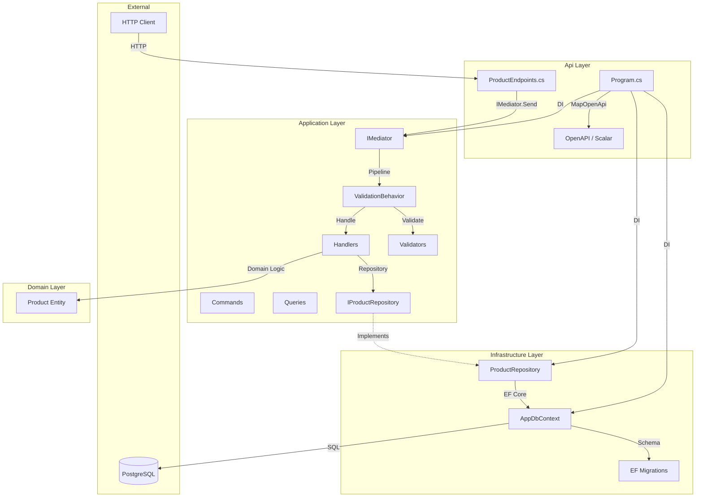
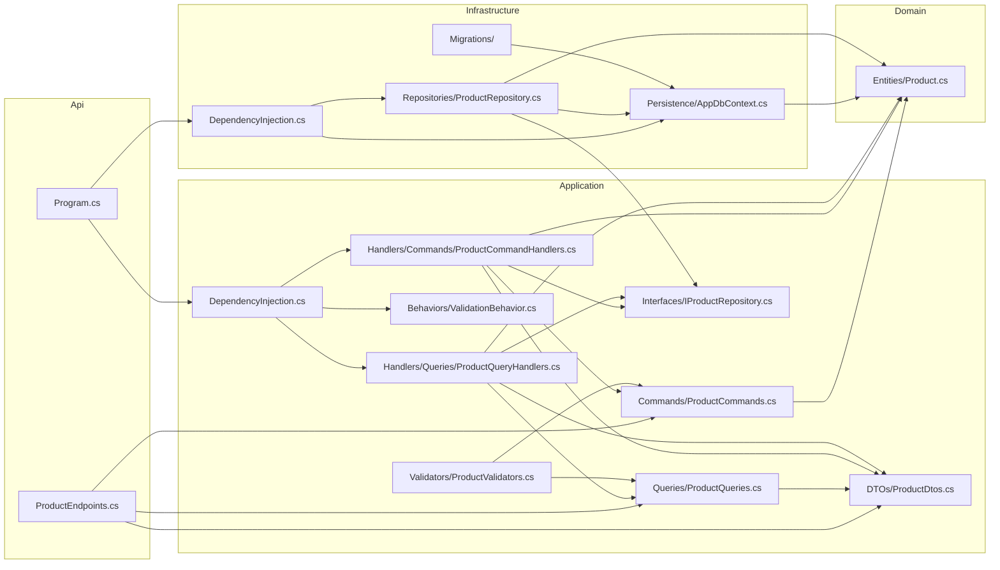

# Technical Documentation

## Table of Contents
1. [Project Overview](#1-project-overview)
2. [Project Structure](#2-project-structure)
3. [Architecture and Application Flow](#3-architecture-and-application-flow)
4. [File and Module Relationships](#4-file-and-module-relationships)
5. [Data Layer](#5-data-layer)
6. [Conventions and Patterns](#6-conventions-and-patterns)
7. [How to Add a New Feature (Step-by-Step Guide)](#7-how-to-add-a-new-feature-step-by-step-guide)
8. [How to Build This Project From Scratch](#8-how-to-build-this-project-from-scratch)
9. [Testing and Debugging](#9-testing-and-debugging)
10. [Known Limitations and Improvement Suggestions](#10-known-limitations-and-improvement-suggestions)

---

## 1. Project Overview

### 1.1 Purpose
**NetPosgre** is a sample ASP.NET Core Minimal API demonstrating Clean Architecture with CQRS (Command Query Responsibility Segregation) using MediatR. It manages a simple Product catalog with CRUD operations and stock adjustments.

### 1.2 Tech Stack

| Category | Technology | Version |
|----------|------------|---------|
| Runtime | .NET | 10.0 |
| Web Framework | ASP.NET Core Minimal APIs | 10.0.12 |
| ORM | Entity Framework Core | 10.0.12 |
| Database | PostgreSQL | Npgsql 10.0.3 |
| Mediator | MediatR (source-generated) | 14.2.0 |
| Validation | FluentValidation | 12.1.1 |
| API Docs | Scalar (OpenAPI) | 2.17.12 |

### 1.3 Installation & Configuration

**Prerequisites:**
- .NET 10 SDK
- PostgreSQL 14+ running locally or accessible

**Environment Variables / Configuration:**
- `ConnectionStrings:Default` - PostgreSQL connection string
  - Default: `Host=localhost;Port=5432;Database=netposgre;Username=postgres;Password=1234`
- `ASPNETCORE_ENVIRONMENT` - `Development` or `Production`

**appsettings.json** (src/Api/appsettings.json):
```json
{
  "ConnectionStrings": {
    "Default": "Host=localhost;Port=5432;Database=netposgre;Username=postgres;Password=1234"
  },
  "Logging": {
    "LogLevel": {
      "Default": "Information",
      "Microsoft.AspNetCore": "Warning"
    }
  },
  "AllowedHosts": "*"
}
```

### 1.4 Commands

| Action | Command |
|--------|---------|
| Build | `dotnet build` |
| Run | `dotnet run --project src/Api` |
| Test | `dotnet test --no-build` |
| Add Migration | `dotnet ef migrations add <Name> --project src/Infrastructure --startup-project src/Api` |
| Update Database | `dotnet ef database update --project src/Infrastructure --startup-project src/Api` |
---

## 2. Project Structure

```
netposgre/
├── AGENTS.MD                    # Project rules and conventions
├── NetPosgre.slnx               # Solution file (VS Code format)
├── TECH_DOC.md                  # This file
├── src/
│   ├── Api/                     # Entry point, endpoints, DI wiring
│   │   ├── Api.csproj
│   │   ├── Program.cs           # App bootstrap
│   │   ├── appsettings.json
│   │   ├── appsettings.Development.json
│   │   └── Endpoints/
│   │       └── ProductEndpoints.cs   # Minimal API endpoints
│   ├── Application/             # Use cases: commands, queries, handlers, DTOs
│   │   ├── Application.csproj
│   │   ├── DependencyInjection.cs    # DI registration
│   │   ├── Behaviors/
│   │   │   └── ValidationBehavior.cs # MediatR pipeline behavior
│   │   ├── Commands/
│   │   │   └── ProductCommands.cs    # Write-side commands
│   │   ├── DTOs/
│   │   │   └── ProductDtos.cs        # Data transfer objects
│   │   ├── Handlers/
│   │   │   ├── Commands/
│   │   │   │   └── ProductCommandHandlers.cs
│   │   │   └── Queries/
│   │   │       └── ProductQueryHandlers.cs
│   │   ├── Interfaces/
│   │   │   └── IProductRepository.cs # Repository abstraction
│   │   ├── Queries/
│   │   │   └── ProductQueries.cs     # Read-side queries
│   │   └── Validators/
│   │       └── ProductValidators.cs  # FluentValidation rules
│   ├── Domain/                  # Pure business logic, zero dependencies
│   │   ├── Domain.csproj
│   │   └── Entities/
│   │       └── Product.cs       # Domain entity with behavior
│   └── Infrastructure/          # EF Core, repositories, external integrations
│       ├── Infrastructure.csproj
│       ├── DependencyInjection.cs    # DI registration
│       ├── Persistence/
│       │   └── AppDbContext.cs       # EF Core DbContext
│       ├── Repositories/
│       │   └── ProductRepository.cs  # Repository implementation
│       └── Migrations/
│           ├── 20261002032357_InitialCreate.cs
│           ├── 20261002032357_InitialCreate.Designer.cs
│           └── AppDbContextModelSnapshot.cs
└── tests/                       # (currently empty)
```

### Layer Responsibilities

| Layer | Responsibility | Key Files |
|-------|---------------|-----------|
| **Api** | HTTP endpoint definitions, DI composition, middleware | `Program.cs`, `ProductEndpoints.cs` |
| **Application** | Use case orchestration, validation, DTOs, repository contracts | `Commands/`, `Queries/`, `Handlers/`, `Validators/`, `Interfaces/` |
| **Domain** | Business entities, value objects, domain logic | `Entities/Product.cs` |
| **Infrastructure** | Database access, EF Core, repository implementations | `AppDbContext.cs`, `ProductRepository.cs`, `Migrations/` |

---

## 3. Architecture and Application Flow

### 3.1 Entry Point & Bootstrapping

**File:** `src/Api/Program.cs`

```csharp
var builder = WebApplication.CreateBuilder(args);

// 1. Register Application layer (MediatR, Validators, Pipeline Behaviors)
builder.Services.AddApplication();

// 2. Register Infrastructure layer (EF Core, Repositories)
builder.Services.AddInfrastructure(builder.Configuration);

// 3. OpenAPI / Scalar for API docs
builder.Services.AddOpenApi();

var app = builder.Build();

// 4. Development-only: OpenAPI + Scalar UI
if (app.Environment.IsDevelopment())
{
    app.MapOpenApi();
    app.MapScalarApiReference();
}

// 5. Map product endpoints
app.MapProductEndpoints();

app.Run();
```

**DependencyInjection.cs files:**
- `Application/DependencyInjection.cs` - Registers MediatR, FluentValidation, ValidationBehavior
- `Infrastructure/DependencyInjection.cs` - Registers DbContext, Repository implementations

### 3.2 Request Lifecycle (Example: POST /api/products)

```
HTTP Request
    │
    ▼
Minimal API Endpoint (ProductEndpoints.cs:29-34)
    │
    ├─► Model binds CreateProductDto from JSON body
    │
    ▼
CreateProductCommand(dto) ───► IMediator.Send(command)
    │
    ▼
ValidationBehavior (Pipeline) ───► CreateProductCommandValidator
    │                                    │
    │                                    ▼
    │                              Validates: Name, Price, Stock
    │                                    │
    │                                    ▼ (if invalid)
    │                              Throws ValidationException
    │
    ▼ (if valid)
CreateProductHandler (ProductCommandHandlers.cs:9-19)
    │
    ├─► Creates Domain.Product entity (Product.cs:14-21)
    │
    ▼
IProductRepository.AddAsync(product) ───► ProductRepository (Infrastructure)
    │
    ├─► DbContext.Products.Add(product)
    │
    ▼
DbContext.SaveChangesAsync() ───► PostgreSQL INSERT
    │
    ▼
Returns ProductDto ───► HTTP 201 Created + Location header
```

### 3.3 Architecture Diagram


---

## 4. File and Module Relationships

### 4.1 Dependency Direction

```
Api ──────────────────► Application ◄────────────────── Infrastructure
  │                         ▲                              │
  │                         │                              │
  └─────────────────────────┴──────────────────────────────┘
                              │
                              ▼
                           Domain
```

**Rules:**
- `Api` references `Application` and `Infrastructure` (for DI only)
- `Application` references `Domain` only
- `Infrastructure` references `Application` (interfaces) and `Domain`
- `Domain` has **zero** external dependencies

### 4.2 Dependency Diagram



### 4.3 Shared Utilities & Global State

| Utility | Location | Used By |
|---------|----------|---------|
| `ValidationBehavior` | `Application/Behaviors/ValidationBehavior.cs` | All MediatR requests (pipeline) |
| `IProductRepository` | `Application/Interfaces/IProductRepository.cs` | Handlers, Infrastructure |
| `AppDbContext` | `Infrastructure/Persistence/AppDbContext.cs` | ProductRepository, Migrations |
| `DependencyInjection` extensions | Each layer's `DependencyInjection.cs` | Program.cs |

---

## 5. Data Layer

### 5.1 Data Model

**Entity:** `Domain.Entities.Product`

```csharp
public class Product
{
    public Guid Id { get; private set; }
    public string Name { get; private set; }
    public decimal Price { get; private set; }
    public int Stock { get; private set; }
    public DateTime CreatedAt { get; private set; }
    public DateTime? UpdatedAt { get; private set; }

    // Factory constructor
    public Product(string name, decimal price, int stock) { ... }

    // Business methods
    public void Update(string name, decimal price, int stock) { ... }
    public void AdjustStock(int quantity) { ... }  // Throws if insufficient
}
```

**Database Schema (from migration):**

| Column | Type | Constraints |
|--------|------|-------------|
| Id | uuid | PK, not null |
| Name | varchar(200) | not null |
| Price | numeric(18,2) | not null |
| Stock | integer | not null |
| CreatedAt | timestamptz | not null |
| UpdatedAt | timestamptz | nullable |

### 5.2 Data Flow

**Read Path (Query):**
```
GetProductsQuery → GetProductsHandler → IProductRepository.GetAllAsync()
    → AppDbContext.Products.OrderBy/Skip/Take → ToListAsync()
    → Map to ProductDto → Return IReadOnlyList<ProductDto>
```

**Write Path (Command):**
```
CreateProductCommand → CreateProductHandler → new Product() (domain)
    → IProductRepository.AddAsync() → DbContext.Add() → SaveChangesAsync()
    → Return ProductDto
```

### 5.3 Validation

| Layer | Validation Type | Implementation |
|-------|----------------|----------------|
| **API** | Model binding | ASP.NET Core automatic |
| **Application** | Business rules | FluentValidation validators (`ProductValidators.cs`) |
| **Domain** | Invariants | Entity methods (`AdjustStock` throws if negative) |
| **Database** | Schema constraints | EF Core model config (`AppDbContext.OnModelCreating`) |

### 5.4 External Integrations

Currently **none** - only PostgreSQL via EF Core. The architecture supports adding external services in `Infrastructure` with interfaces defined in `Application.Interfaces`.

---

## 6. Conventions and Patterns

### 6.1 Naming Conventions

| Element | Convention | Example |
|---------|------------|---------|
| Commands | `{Action}{Entity}Command` | `CreateProductCommand` |
| Queries | `{Action}{Entity}Query` | `GetProductQuery` |
| Handlers | `{Command/Query}Handler` | `CreateProductHandler` |
| DTOs | `{Action}{Entity}Dto` | `CreateProductDto` |
| Validators | `{Command}Validator` | `CreateProductCommandValidator` |
| Repository Interface | `I{Entity}Repository` | `IProductRepository` |
| Repository Impl | `{Entity}Repository` | `ProductRepository` |
| Endpoints | `{Entity}Endpoints` | `ProductEndpoints` |
| Map Extension | `Map{Entity}Endpoints` | `MapProductEndpoints` |

### 6.2 Code Style

- **Nullable enabled** (`<Nullable>enable</Nullable>`)
- **Implicit usings** enabled
- **Records** for DTOs, commands, queries (immutable)
- **Sealed classes** for handlers
- **Private setters** on domain entities
- **Constructor injection** for dependencies
- **CancellationToken** passed through all async methods

### 6.3 Error Handling

| Scenario | Pattern | Example |
|----------|---------|---------|
| Not found | `KeyNotFoundException` | Handler throws, endpoint returns 404 |
| Validation fail | `ValidationException` | Pipeline behavior throws, returns 400 |
| Business rule violation | `InvalidOperationException` | `AdjustStock` throws if insufficient |
| Unexpected | Unhandled → 500 | ASP.NET Core default |

**No custom exception middleware** - relies on default ASP.NET Core behavior.

### 6.4 Logging

- Uses built-in `ILogger` via DI
- Configured in `appsettings.json` (Debug in Development, Information in Production)
- No structured logging library (Serilog, etc.) currently configured

### 6.5 Authentication / Authorization

**Not implemented** - endpoints are open. To add:
1. Add `Microsoft.AspNetCore.Authentication.JwtBearer` to Api.csproj
2. Configure in `Program.cs`
3. Add `[Authorize]` or `RequireAuthorization()` to endpoints

### 6.6 Recurring Design Patterns

| Pattern | Where Used |
|---------|------------|
| **CQRS** | Separate Commands (write) and Queries (read) |
| **Mediator** | `IMediator` decouples endpoints from handlers |
| **Pipeline Behavior** | `ValidationBehavior` runs before every request |
| **Repository** | `IProductRepository` abstracts data access |
| **Domain Model** | `Product` encapsulates business logic |
| **Dependency Injection** | All layers registered via extension methods |
| **Minimal APIs** | `MapGet`, `MapPost`, etc. in `ProductEndpoints.cs` |
---

## 7. How to Add a New Feature (Step-by-Step Guide)

### 7.1 Reference Feature: Product Stock Adjustment

**Files involved:**
- `Application/Commands/ProductCommands.cs` - `AdjustStockCommand`
- `Application/DTOs/ProductDtos.cs` - (no new DTO, uses command param)
- `Application/Validators/ProductValidators.cs` - `AdjustStockCommandValidator`
- `Application/Handlers/Commands/ProductCommandHandlers.cs` - `AdjustStockHandler`
- `Domain/Entities/Product.cs` - `AdjustStock` method
- `Application/Interfaces/IProductRepository.cs` - (uses existing methods)
- `Infrastructure/Repositories/ProductRepository.cs` - (uses existing methods)
- `Api/Endpoints/ProductEndpoints.cs` - `MapPatch("/{id:guid}/stock")`

### 7.2 Step-by-Step: Adding a "Category" Feature

#### Step 1: Domain Entity (src/Domain/Entities/Category.cs)
```csharp
namespace Domain.Entities;

public class Category
{
    public Guid Id { get; private set; }
    public string Name { get; private set; }
    public string? Description { get; private set; }
    public DateTime CreatedAt { get; private set; }

    private Category() { }

    public Category(string name, string? description = null)
    {
        Id = Guid.NewGuid();
        Name = name;
        Description = description;
        CreatedAt = DateTime.UtcNow;
    }

    public void Update(string name, string? description)
    {
        Name = name;
        Description = description;
    }
}
```

#### Step 2: DTOs (src/Application/DTOs/CategoryDtos.cs)
```csharp
namespace Application.DTOs;

public record CategoryDto(Guid Id, string Name, string? Description, DateTime CreatedAt);
public record CreateCategoryDto(string Name, string? Description);
public record UpdateCategoryDto(string Name, string? Description);
```

#### Step 3: Commands (src/Application/Commands/CategoryCommands.cs)
```csharp
using Application.DTOs;
using MediatR;

namespace Application.Commands;

public record CreateCategoryCommand(CreateCategoryDto Dto) : IRequest<CategoryDto>;
public record UpdateCategoryCommand(Guid Id, UpdateCategoryDto Dto) : IRequest<CategoryDto>;
public record DeleteCategoryCommand(Guid Id) : IRequest<Unit>;
```

#### Step 4: Queries (src/Application/Queries/CategoryQueries.cs)
```csharp
using Application.DTOs;
using MediatR;

namespace Application.Queries;

public record GetCategoryQuery(Guid Id) : IRequest<CategoryDto?>;
public record GetCategoriesQuery(int Page, int PageSize) : IRequest<IReadOnlyList<CategoryDto>>;
```

#### Step 5: Validators (src/Application/Validators/CategoryValidators.cs)
```csharp
using Application.Commands;
using Application.DTOs;
using FluentValidation;

namespace Application.Validators;

public class CreateCategoryCommandValidator : AbstractValidator<CreateCategoryCommand>
{
    public CreateCategoryCommandValidator()
    {
        RuleFor(x => x.Dto.Name).NotEmpty().MaximumLength(100);
        RuleFor(x => x.Dto.Description).MaximumLength(500);
    }
}

public class UpdateCategoryCommandValidator : AbstractValidator<UpdateCategoryCommand>
{
    public UpdateCategoryCommandValidator()
    {
        RuleFor(x => x.Id).NotEmpty();
        RuleFor(x => x.Dto.Name).NotEmpty().MaximumLength(100);
        RuleFor(x => x.Dto.Description).MaximumLength(500);
    }
}
```
#### Step 6: Repository Interface (src/Application/Interfaces/ICategoryRepository.cs)
```csharp
using Domain.Entities;

namespace Application.Interfaces;

public interface ICategoryRepository
{
    Task<Category?> GetByIdAsync(Guid id, CancellationToken ct = default);
    Task<IReadOnlyList<Category>> GetAllAsync(int page, int pageSize, CancellationToken ct = default);
    Task AddAsync(Category category, CancellationToken ct = default);
    Task UpdateAsync(Category category, CancellationToken ct = default);
    Task DeleteAsync(Category category, CancellationToken ct = default);
    Task<int> CountAsync(CancellationToken ct = default);
}
```

#### Step 7: Command Handlers (src/Application/Handlers/Commands/CategoryCommandHandlers.cs)
```csharp
using Application.Commands;
using Application.DTOs;
using Application.Interfaces;
using Domain.Entities;
using MediatR;

namespace Application.Handlers.Commands;

public sealed class CreateCategoryHandler(ICategoryRepository repo) : IRequestHandler<CreateCategoryCommand, CategoryDto>
{
    public async Task<CategoryDto> Handle(CreateCategoryCommand cmd, CancellationToken ct)
    {
        var category = new Category(cmd.Dto.Name, cmd.Dto.Description);
        await repo.AddAsync(category, ct);
        return ToDto(category);
    }
    private static CategoryDto ToDto(Category c) => new(c.Id, c.Name, c.Description, c.CreatedAt);
}

public sealed class UpdateCategoryHandler(ICategoryRepository repo) : IRequestHandler<UpdateCategoryCommand, CategoryDto>
{
    public async Task<CategoryDto> Handle(UpdateCategoryCommand cmd, CancellationToken ct)
    {
        var category = await repo.GetByIdAsync(cmd.Id, ct) 
            ?? throw new KeyNotFoundException($"Category {cmd.Id} not found");
        category.Update(cmd.Dto.Name, cmd.Dto.Description);
        await repo.UpdateAsync(category, ct);
        return ToDto(category);
    }
    private static CategoryDto ToDto(Category c) => new(c.Id, c.Name, c.Description, c.CreatedAt);
}

public sealed class DeleteCategoryHandler(ICategoryRepository repo) : IRequestHandler<DeleteCategoryCommand, Unit>
{
    public async Task<Unit> Handle(DeleteCategoryCommand cmd, CancellationToken ct)
    {
        var category = await repo.GetByIdAsync(cmd.Id, ct) 
            ?? throw new KeyNotFoundException($"Category {cmd.Id} not found");
        await repo.DeleteAsync(category, ct);
        return Unit.Value;
    }
}
```
#### Step 8: Query Handlers (src/Application/Handlers/Queries/CategoryQueryHandlers.cs)
```csharp
using Application.DTOs;
using Application.Interfaces;
using Application.Queries;
using MediatR;

namespace Application.Handlers.Queries;

public sealed class GetCategoryHandler(ICategoryRepository repo) : IRequestHandler<GetCategoryQuery, CategoryDto?>
{
    public async Task<CategoryDto?> Handle(GetCategoryQuery query, CancellationToken ct)
    {
        var category = await repo.GetByIdAsync(query.Id, ct);
        return category is null ? null : ToDto(category);
    }
    private static CategoryDto ToDto(Domain.Entities.Category c) => new(c.Id, c.Name, c.Description, c.CreatedAt);
}

public sealed class GetCategoriesHandler(ICategoryRepository repo) : IRequestHandler<GetCategoriesQuery, IReadOnlyList<CategoryDto>>
{
    public async Task<IReadOnlyList<CategoryDto>> Handle(GetCategoriesQuery query, CancellationToken ct)
    {
        var categories = await repo.GetAllAsync(query.Page, query.PageSize, ct);
        return categories.Select(ToDto).ToList();
    }
    private static CategoryDto ToDto(Domain.Entities.Category c) => new(c.Id, c.Name, c.Description, c.CreatedAt);
}
```

#### Step 9: Infrastructure - EF Configuration (src/Infrastructure/Persistence/AppDbContext.cs)
```csharp
// Add to AppDbContext:
public DbSet<Category> Categories => Set<Category>();

protected override void OnModelCreating(ModelBuilder modelBuilder)
{
    // ... existing Product config ...
    
    modelBuilder.Entity<Category>(entity =>
    {
        entity.HasKey(e => e.Id);
        entity.Property(e => e.Name).HasMaxLength(100).IsRequired();
        entity.Property(e => e.Description).HasMaxLength(500);
        entity.Property(e => e.CreatedAt).IsRequired();
    });
}
```

#### Step 10: Repository Implementation (src/Infrastructure/Repositories/CategoryRepository.cs)
```csharp
using Application.Interfaces;
using Domain.Entities;
using Infrastructure.Persistence;
using Microsoft.EntityFrameworkCore;

namespace Infrastructure.Repositories;

public sealed class CategoryRepository(AppDbContext db) : ICategoryRepository
{
    public async Task<Category?> GetByIdAsync(Guid id, CancellationToken ct = default)
        => await db.Categories.FirstOrDefaultAsync(c => c.Id == id, ct);

    public async Task<IReadOnlyList<Category>> GetAllAsync(int page, int pageSize, CancellationToken ct = default)
        => await db.Categories
            .OrderBy(c => c.Name)
            .Skip((page - 1) * pageSize)
            .Take(pageSize)
            .ToListAsync(ct);

    public async Task AddAsync(Category category, CancellationToken ct = default)
    {
        db.Categories.Add(category);
        await db.SaveChangesAsync(ct);
    }

    public async Task UpdateAsync(Category category, CancellationToken ct = default)
    {
        db.Categories.Update(category);
        await db.SaveChangesAsync(ct);
    }

    public async Task DeleteAsync(Category category, CancellationToken ct = default)
    {
        db.Categories.Remove(category);
        await db.SaveChangesAsync(ct);
    }

    public async Task<int> CountAsync(CancellationToken ct = default)
        => await db.Categories.CountAsync(ct);
}
```
#### Step 11: Infrastructure DI (src/Infrastructure/DependencyInjection.cs)
```csharp
// Add to AddInfrastructure:
services.AddScoped<ICategoryRepository, CategoryRepository>();
```

#### Step 12: Migration
```bash
dotnet ef migrations add AddCategory --project src/Infrastructure --startup-project src/Api
dotnet ef database update --project src/Infrastructure --startup-project src/Api
```

#### Step 13: Endpoints (src/Api/Endpoints/CategoryEndpoints.cs)
```csharp
using Application.Commands;
using Application.DTOs;
using Application.Queries;
using MediatR;
using Microsoft.AspNetCore.Mvc;

namespace Api.Endpoints;

public static class CategoryEndpoints
{
    public static void MapCategoryEndpoints(this WebApplication app)
    {
        var group = app.MapGroup("/api/categories").WithTags("Categories");

        group.MapGet("/", async (IMediator mediator, int page = 1, int pageSize = 10) =>
        {
            var result = await mediator.Send(new GetCategoriesQuery(page, pageSize));
            return Results.Ok(result);
        });

        group.MapGet("/{id:guid}", async (IMediator mediator, Guid id) =>
        {
            var result = await mediator.Send(new GetCategoryQuery(id));
            return result is not null ? Results.Ok(result) : Results.NotFound();
        });

        group.MapPost("/", async (IMediator mediator, [FromBody] CreateCategoryDto dto) =>
        {
            var result = await mediator.Send(new CreateCategoryCommand(dto));
            return Results.Created($"/api/categories/{result.Id}", result);
        });

        group.MapPut("/{id:guid}", async (IMediator mediator, Guid id, [FromBody] UpdateCategoryDto dto) =>
        {
            var result = await mediator.Send(new UpdateCategoryCommand(id, dto));
            return Results.Ok(result);
        });

        group.MapDelete("/{id:guid}", async (IMediator mediator, Guid id) =>
        {
            await mediator.Send(new DeleteCategoryCommand(id));
            return Results.NoContent();
        });
    }
}
```

#### Step 14: Register Endpoints (src/Api/Program.cs)
```csharp
app.MapCategoryEndpoints(); // Add after MapProductEndpoints
```

### 7.3 Checklist for New Features

| Step | Task | Files to Create/Modify |
|------|------|------------------------|
| 1 | Domain entity | `src/Domain/Entities/{Entity}.cs` |
| 2 | DTOs | `src/Application/DTOs/{Entity}Dtos.cs` |
| 3 | Commands | `src/Application/Commands/{Entity}Commands.cs` |
| 4 | Queries | `src/Application/Queries/{Entity}Queries.cs` |
| 5 | Validators | `src/Application/Validators/{Entity}Validators.cs` |
| 6 | Repository Interface | `src/Application/Interfaces/I{Entity}Repository.cs` |
| 7 | Command Handlers | `src/Application/Handlers/Commands/{Entity}CommandHandlers.cs` |
| 8 | Query Handlers | `src/Application/Handlers/Queries/{Entity}QueryHandlers.cs` |
| 9 | EF Config | `src/Infrastructure/Persistence/AppDbContext.cs` |
| 10 | Repository Impl | `src/Infrastructure/Repositories/{Entity}Repository.cs` |
| 11 | Infrastructure DI | `src/Infrastructure/DependencyInjection.cs` |
| 12 | Migration | Run EF migration commands |
| 13 | Endpoints | `src/Api/Endpoints/{Entity}Endpoints.cs` |
| 14 | Register Endpoints | `src/Api/Program.cs` |
| 15 | Tests | Add unit/integration tests |
---

## 8. How to Build This Project From Scratch

### 8.1 Project Initialization Order

```bash
# 1. Create solution
dotnet new sln -n NetPosgre

# 2. Create Domain (no dependencies)
dotnet new classlib -n Domain -o src/Domain
dotnet sln add src/Domain/Domain.csproj

# 3. Create Application (references Domain)
dotnet new classlib -n Application -o src/Application
dotnet sln add src/Application/Application.csproj
dotnet add src/Application/Application.csproj reference src/Domain/Domain.csproj

# 4. Add Application packages
dotnet add src/Application/Application.csproj package MediatR
dotnet add src/Application/Application.csproj package FluentValidation
dotnet add src/Application/Application.csproj package FluentValidation.DependencyInjectionExtensions

# 5. Create Infrastructure (references Application + Domain)
dotnet new classlib -n Infrastructure -o src/Infrastructure
dotnet sln add src/Infrastructure/Infrastructure.csproj
dotnet add src/Infrastructure/Infrastructure.csproj reference src/Application/Application.csproj
dotnet add src/Infrastructure/Infrastructure.csproj reference src/Domain/Domain.csproj

# 6. Add Infrastructure packages
dotnet add src/Infrastructure/Infrastructure.csproj package Microsoft.EntityFrameworkCore
dotnet add src/Infrastructure/Infrastructure.csproj package Npgsql.EntityFrameworkCore.PostgreSQL
dotnet add src/Infrastructure/Infrastructure.csproj package Microsoft.EntityFrameworkCore.Tools

# 7. Create API (references Application + Infrastructure)
dotnet new web -n Api -o src/Api
dotnet sln add src/Api/Api.csproj
dotnet add src/Api/Api.csproj reference src/Application/Application.csproj
dotnet add src/Api/Api.csproj reference src/Infrastructure/Infrastructure.csproj

# 8. Add API packages
dotnet add src/Api/Api.csproj package MediatR
dotnet add src/Api/Api.csproj package Microsoft.AspNetCore.OpenApi
dotnet add src/Api/Api.csproj package Microsoft.EntityFrameworkCore.Design
dotnet add src/Api/Api.csproj package Scalar.AspNetCore
```

### 8.2 Design Decision Reasoning

| Step | Reason |
|------|--------|
| **Domain first** | Zero dependencies = most stable, defines ubiquitous language |
| **Application second** | Contains use cases, depends only on Domain abstractions |
| **Infrastructure third** | Implements Application interfaces, depends on both |
| **API last** | Thin host, composes DI from other layers |
| **MediatR in both Api and Application** | Api needs it for endpoint → mediator; Application needs it for handler registration |
| **EF Core Design in Api** | Required for `dotnet ef` commands (startup project) |

### 8.3 Core Module Implementation Order

1. **Domain Entity** - `Product.cs` with business logic
2. **Repository Interface** - `IProductRepository` in Application
3. **Commands/Queries/DTOs** - Application layer contracts
4. **Validators** - FluentValidation rules
5. **Handlers** - Business logic orchestration
6. **DbContext** - EF Core configuration
7. **Repository Implementation** - EF Core queries
8. **DI Extensions** - Each layer's `DependencyInjection.cs`
9. **Migration** - `dotnet ef migrations add InitialCreate`
10. **Endpoints** - Minimal API mapping
11. **Program.cs** - Wire everything together
---

## 9. Testing and Debugging

### 9.1 Test Organization (Currently Empty)

**Recommended structure:**
```
tests/
├── UnitTests/
│   ├── Application/
│   │   ├── Handlers/
│   │   ├── Validators/
│   │   └── Commands/
│   └── Domain/
│       └── Entities/
├── IntegrationTests/
│   ├── Endpoints/
│   └── Repositories/
└── TestBase/
    ├── TestFixture.cs
    └── TestContainers/ (for Postgres)
```

### 9.2 Running Tests

```bash
# All tests
dotnet test

# With coverage
dotnet test --collect:"XPlat Code Coverage"

# Specific project
dotnet test tests/UnitTests/UnitTests.csproj
```

### 9.3 Common Issues & Troubleshooting

| Issue | Cause | Solution |
|-------|-------|----------|
| `Connection string 'Default' not found` | Missing appsettings or env var | Check `appsettings.json`, `ASPNETCORE_ENVIRONMENT` |
| `Cannot connect to PostgreSQL` | DB not running / wrong credentials | Verify PostgreSQL service, connection string |
| `Migration fails` | Schema mismatch / pending changes | Run `dotnet ef database update` |
| `Validation not working` | Validator not registered | Check `AddValidatorsFromAssembly` in Application DI |
| `Handler not found` | MediatR not scanning assembly | Verify `AddMediatR` with correct assembly |
| `Null reference in handler` | Repository not registered | Check Infrastructure DI `AddScoped<IProductRepository, ProductRepository>()` |
| `OpenAPI not showing` | Not in Development env | Set `ASPNETCORE_ENVIRONMENT=Development` |

### 9.4 Debugging Tips

- **Breakpoints in handlers** - Works normally with `dotnet run`
- **SQL logging** - Add to `appsettings.Development.json`:
  ```json
  "Logging": {
    "LogLevel": {
      "Microsoft.EntityFrameworkCore.Database.Command": "Information"
    }
  }
  ```
- **Scalar UI** - Visit `http://localhost:<port>/scalar/v1` in Development
- **Request inspection** - Use `app.UseHttpLogging()` in Program.cs

---

## 10. Known Limitations and Improvement Suggestions

### 10.1 Technical Debt

| Area | Issue | Severity |
|------|-------|----------|
| **No Tests** | Zero test coverage | High |
| **No Auth** | All endpoints public | High |
| **No Global Exception Handling** | Raw exceptions bubble to 500 | Medium |
| **No Logging Structure** | Basic console only | Medium |
| **No Health Checks** | No `/health` endpoint | Low |
| **No Rate Limiting** | No API protection | Low |
| **No CORS Policy** | Default allows all | Low |

### 10.2 Risky Areas

1. **`AdjustStock` concurrency** - No optimistic locking; race condition possible on high concurrency
2. **No transaction scope** - Each repository method calls `SaveChangesAsync` independently
3. **No pagination metadata** - `GetProducts` returns list without total count
4. **Hardcoded connection string** - Should use secrets/user-secrets in production

### 10.3 Improvement Suggestions

| Improvement | Effort | Impact |
|-------------|--------|--------|
| Add xUnit + Moq + Testcontainers tests | Medium | High |
| Add JWT Authentication | Medium | High |
| Add global exception middleware | Low | Medium |
| Add Serilog + Seq/Elastic | Low | Medium |
| Add health checks (`/health`) | Low | Medium |
| Add optimistic concurrency (rowversion) | Medium | Medium |
| Add pagination response wrapper | Low | Low |
| Add request/response logging middleware | Low | Low |
| Add API versioning | Medium | Low |
| Add integration tests with Testcontainers | Medium | High |

### 10.4 Missing Pieces (from AGENTS.MD expectations)

- **Tests folder empty** - Violates "Run `dotnet test` after every implementation" workflow
- **No CI/CD pipeline** - No GitHub Actions, GitLab CI, etc.
- **No Dockerfile** - Containerization not configured
- **No API versioning strategy** - Will need for breaking changes

---

*Generated from codebase analysis on 2026-10-02*